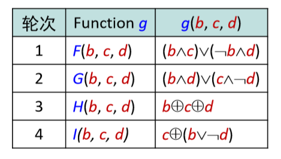

# MD5 算法设计与实现

## 算法原理概述

MD5 算法全称**MD5信息摘要算法(MD5 Message-Digest Algorithm)**， 是一种比较常见和简单的密码散列函数，用于生成一个128位的散列值确保信息传输完整一致。由于MD5的不可逆性，一般会用来加密保存在数据库中的密码字串，又由于MD5存在扩散性，即使原来的数据只有1位错误，生成出来的散列值都会完全不同，因此也可以用于计算数据指纹。

MD5算法的主要原理就是对原始数据经过多次的迭代，将数据中的每一位都重复混淆和扩散到散列值当中。

## 总体结构

其基本的算法流程如下图：


MD5算法的**基本过程**为：填充、分块、缓冲区初始化、循环压缩、得出结果

将原始数据填充并划分为512位的块后，每一个数据块，对初始向量(IV)使用四个不同的生成函数进行4轮循环迭代，在每次循环中结合T表元素和512位的原始数据进行16次迭代，将数据充分扩散和混淆。

最后将初始向量经过迭代之后的值以16进制输出，就是MD5算法生成的散列值。


## 模块分解

我们可以将MD5算法分为**填充分块**和**循环压缩**两个基本模块

### 填充分块

首先是填充和分块

在加密压缩之前，我们先要保证数据是512位的整数倍，也就是说需要划分若干个为512位的数据块，如果一个数据块不够512位，就必须填充够512位。

由于消息的尾部还需要附加原始信息位数的低64位，因此需要保证最后一块的位数为`512-64=488`位。

由于这里用字符串作为原始消息，因此每一位字符是占8位（1Byte）的，因此每一个块就为`64Byte`，填充是使用`1000......000`来补全剩余的字符的，因此第一位填充`0x80`，后面填充`0x00`

首先计算需要填充的`0x00`的个数

```c++
int paddingCount = len % 64;
paddingCount = paddingCount > 55 ? 119 - paddingCount
                                   : 55 - paddingCount;  // 填充0x0的个数
```

如果目前最后一块的字节小于`56`，那只需要填充满这一块的前`56`位

如果目前最后一块的字节大于或等于`56`，就需要额外填充一块，使得直到填充满下一块的前`56`位

```c++
// 读取数据
for (int i = 0; i < len; i++) {
  bitset.AddByte(data[i]);
}
// 填充首位1
bitset.AddByte(0x80);
// 填充0
for (int i = 0; i < paddingCount; i++) {
  bitset.AddByte(0x00);
}
```

最后把原始信息位数的低64位填充到最后一块，使得其长度达到`512`位

```c++
vector<bit32> parts = bitset.GetBitSet();
// 填充(长度 mod 2^64)
parts.push_back((len * 8) & 0xffff);
parts.push_back(((len * 8) >> 32) & 0xffff);
MD5::parts = parts;
```

最后每一块得出16个`32`位的数据分块


### 循环压缩

MD5算法中对于数据最主要的操作就在于循环压缩部分

首先需要对初始向量进行初始化

```
 A= 0x67452301
 B= 0xEFCDAB89
 C= 0x98BADCFE
 D= 0x10325476
```

需要注意的是，这里的初始向量在内存当中需要为小端编码保存，即将低位字节放在内存的低地址段。否则接下来进行移位的时候数据会有不同，C和C++都是使用小端编码的，而Java是采用大端编码。

对于每512位原始数据，进行4*16次迭代

在4轮迭代中，使用不同的函数对于上面初始化的`B,C,D`进行操作



然后在4次迭代中，进行16次迭代


其中

- g为上面的函数

- X为本轮16个32位的分块的第`k`个32位分块

  - K在每一轮中分别由不同的方法确定，这里将其生成为一个64个元素的表，根据当前迭代次数获取

- T同样为一个表，是由指定函数生成的$T[i] = int(2^{32}\times|sin(i)|)$，为了计算速度，这里同样生成一个64个元素的表，根据迭代次数获取

- s为循环左移，同样是预设的一个64个元素的表

经过64次迭代之后，将ABCD向右循环移动一个位置


对消息中的每512位做上面的迭代处理。

最后将128位的ABCD以16进制输出，就可以得到32位的16进制散列值字符串

注意：需要以小端模式输出


## 数据结构

首先定义上面的各种表

```c++

namespace MD5 {
// MD缓冲区 （初始化为初始向量）
bit32 MD[4] = {0x67452301, 0xEFCDAB89, 0x98BADCFE, 0x10325476};
// T表
bit32 T[64] = {
    0xd76aa478, 0xe8c7b756, 0x242070db, 0xc1bdceee, 0xf57c0faf, 0x4787c62a,
    0xa8304613, 0xfd469501, 0x698098d8, 0x8b44f7af, 0xffff5bb1, 0x895cd7be,
    0x6b901122, 0xfd987193, 0xa679438e, 0x49b40821, 0xf61e2562, 0xc040b340,
    0x265e5a51, 0xe9b6c7aa, 0xd62f105d, 0x02441453, 0xd8a1e681, 0xe7d3fbc8,
    0x21e1cde6, 0xc33707d6, 0xf4d50d87, 0x455a14ed, 0xa9e3e905, 0xfcefa3f8,
    0x676f02d9, 0x8d2a4c8a, 0xfffa3942, 0x8771f681, 0x6d9d6122, 0xfde5380c,
    0xa4beea44, 0x4bdecfa9, 0xf6bb4b60, 0xbebfbc70, 0x289b7ec6, 0xeaa127fa,
    0xd4ef3085, 0x04881d05, 0xd9d4d039, 0xe6db99e5, 0x1fa27cf8, 0xc4ac5665,
    0xf4292244, 0x432aff97, 0xab9423a7, 0xfc93a039, 0x655b59c3, 0x8f0ccc92,
    0xffeff47d, 0x85845dd1, 0x6fa87e4f, 0xfe2ce6e0, 0xa3014314, 0x4e0811a1,
    0xf7537e82, 0xbd3af235, 0x2ad7d2bb, 0xeb86d391};
// S表（移位位数）
byte s[64] = {7, 12, 17, 22, 7, 12, 17, 22, 7, 12, 17, 22, 7, 12, 17, 22,
             5, 9,  14, 20, 5, 9,  14, 20, 5, 9,  14, 20, 5, 9,  14, 20,
             4, 11, 16, 23, 4, 11, 16, 23, 4, 11, 16, 23, 4, 11, 16, 23,
             6, 10, 15, 21, 6, 10, 15, 21, 6, 10, 15, 21, 6, 10, 15, 21};
// X表（对原始消息取值的位置）
byte X[4][16] = {{0, 1, 2, 3, 4, 5, 6, 7, 8, 9, 10, 11, 12, 13, 14, 15},
                {1, 6, 11, 0, 5, 10, 15, 4, 9, 14, 3, 8, 13, 2, 7, 1},
                {5, 8, 11, 14, 1, 4, 7, 10, 13, 0, 3, 6, 9, 12, 15, 2},
                {0, 7, 14, 5, 12, 3, 10, 1, 8, 15, 6, 13, 4, 11, 2, 9}};
// 存储32bit的分块
vector<bit32> parts;
};  // namespace MD5
```


## C 语言源代码

[Github](https://github.com/ZhenlyChen/MD5-Cpp)


## 编译运行结果

首先对一个短的字符串测试


然后在网上找一个[MD5生成的工具](https://www.miraclesalad.com/webtools/md5.php)进行比对测试


生成的结果是一致的

然后对一个比较长的字符串测试


其他工具生成结果


结果都是为`96082dc5b1f48bac0d106942e65aaa3c`

结果说明该MD5算法**符合标准**
